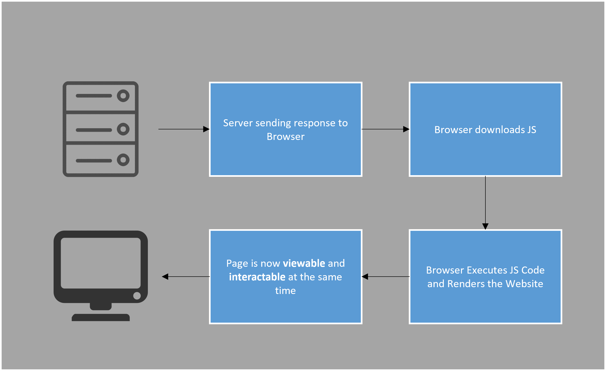

# Server-Side and Client-Side Rendering

### Server-Side Rendering
 * With server-side rendering, we deliver the content of a page by converting HTML files in the server into usable information for the browser.
  
 * When we visit a website, our browser makes a request to the server which contains the contents of the website. After the request, server renders and delivers the rendered HTML response. After our browser receives the response, it displays the page on our screen. 

 * If we decide to visit a different page, our browser will make a request again for that new page. This process will repeat as long as we ask for new pages. (If the browser doesn't have the page in its cache.)

 * Even only one line of HTML code changes, browser has to make a request for entire page.

### Pros
 * Initial page load is faster.
 * Great for non-interactable static websites.
 * High search engine optimization.

### Cons
 * Many server requests.
 * Making page interactable is slow.
 * On any difference on page done by the user, whole page needs to be requested again from server.
 * Interactions are limited.

#
### Client-Side Rendering
 * With client-side rendering, we are rendering the content in the browser with the help of client-side scripting languages like JavaScript. 
  
 * So the server delivers bare HTML document with JavaScript file (or with any other server-side scripting language) and allows the browser to render the website.

### Pros
* Interactions are rich.
* Making page interactable is fast.
* Page can be updated without any server request.
* Great for web applications.

### Cons
* Initial load requires more time.
* Low search engine optimization if not implemented correctly.

